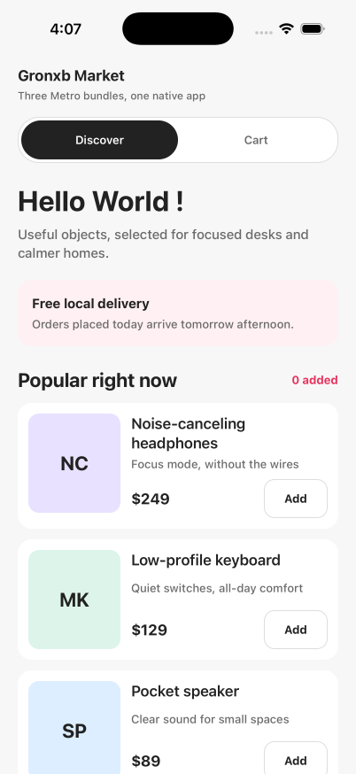

# super-app-with-zephyr-cloud

A React Native super app built with Metro Module Federation and Zephyr Cloud. One native host loads the independently deployable `discover` and `cart` applications while sharing a common cart store.

<table>
  <tr>
    <th>Discover</th>
    <th>Cart</th>
  </tr>
  <tr>
    <td>
      
    </td>
    <td>
      
    </td>
  </tr>
</table>


## Architecture

```text
apps/host       React Native host and native iOS/Android projects
apps/discover   Product discovery remote
apps/cart       Shopping cart remote
packages/store  Shared cart contract and store
```

Metro produces the React Native bundles. Module Federation defines the host, remote containers, exposed modules, shared dependencies, and runtime loading behavior. Zephyr integrates with that build lifecycle to resolve remote dependencies and publish versioned build artifacts.

Only the host owns native projects. The remote applications contain JavaScript, Metro, and Module Federation configuration and can be developed and deployed independently.

## Requirements

- Node.js 20 or later
- pnpm 11.6.0
- Xcode with an iOS Simulator
- A Zephyr Cloud account for remote deployments

## Setup

```bash
pnpm install
pnpm verify
```

## Local Development

Build and install the debug host:

```bash
pnpm build:ios:simulator
xcrun simctl install booted apps/host/build/Build/Products/Debug-iphonesimulator/ZephyrCloudHostApp.app
```

Start the three Metro servers in separate terminals:

```bash
pnpm --dir apps/host start
```

```bash
pnpm --dir apps/discover start
```

```bash
pnpm --dir apps/cart start
```

Launch the installed application:

```bash
xcrun simctl launch booted org.reactjs.native.example.ZephyrCloudHostApp
```

The host runs on port 8081. The `cart` and `discover` remotes run on ports 8082 and 8083.


https://github.com/user-attachments/assets/e2c9dc34-2c81-4723-b247-7d5032389e98


## Zephyr Deployment

Deploy the remote applications before building a new release host:

```bash
pnpm --dir apps/cart deploy:zephyr:ios
pnpm --dir apps/discover deploy:zephyr:ios
```

The host resolves remote applications through the `zephyr:dependencies` field in `apps/host/package.json`. Use the Application UIDs and environment configured for your Zephyr organization.

Build and install the release host:

```bash
pnpm build:ios:simulator:release
xcrun simctl install booted apps/host/build/Build/Products/Release-iphonesimulator/ZephyrCloudHostApp.app
xcrun simctl launch booted org.reactjs.native.example.ZephyrCloudHostApp
```

Remote-only changes can be published without rebuilding the native host:

```bash
pnpm --dir apps/discover deploy:zephyr:ios
```


https://github.com/user-attachments/assets/33cf0772-487a-47f9-b7cf-418f9fcead55


## Workspace Commands

| Command                            | Description                              |
| ---------------------------------- | ---------------------------------------- |
| `pnpm verify`                      | Run formatting, lint, and type checks    |
| `pnpm lint`                        | Run formatting and lint checks           |
| `pnpm test:type`                   | Type-check all workspace projects        |
| `pnpm build:ios:simulator`         | Build the debug iOS Simulator host       |
| `pnpm build:ios:simulator:release` | Build the release iOS Simulator host     |
| `pnpm kill:ports`                  | Stop the local Metro development servers |

## Metro Compatibility Patch

The workspace applies [`patches/zephyr-metro-plugin.patch`](./patches/zephyr-metro-plugin.patch) through pnpm `patchedDependencies`. It preserves Zephyr-resolved remote configuration across the additional Metro configuration load performed by the current React Native CLI integration.
